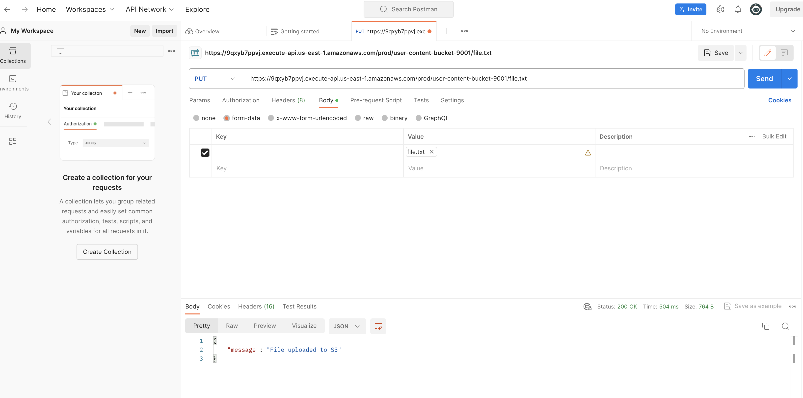

## Implementing a file storage service for user content using API Gateway, S3, and Cognito

### Create a Serverless file upload service where **authenticated** users can securely upload files to an S3 bucket through an API Gateway endpoint and file will be uplaoded to the S3 directly.
    

##### In this we are also going to use Web Identity Federation using Cognito.

Steps -

1. Create Backend infrastructure for example - API Gateway and S3 bucket for the file upload. Enable AWS_IAM authentication for the API Gateway.

AWS_Link - [https://docs.aws.amazon.com/apigateway/latest/developerguide/integrating-api-with-aws-services-s3.html]

2. Create S3 bucket for website hosting and CloudFront distribution for the Content Delivery.
3. Create Google API Project and create client ID. Provide Cloudfront distribution for Javascript origin page.
4. Create Cognito Identiy pool and provide the Google Client ID created in the previous step.
5. Create HTML and Javascript for the front end -
    - There wil be sign in with Google button whihc will allow users to sign in with their Google Account.
    - After signing in, Google ID token will be generated, We'll be using this toeken and exchange credetials from Cognito and will get the temporary credentials.
    - Using these temporary credential, there will be a call to the Rest API gateway. User will be able to successfully upload the files.


Ref Docs -


https://docs.aws.amazon.com/apigateway/latest/developerguide/integrating-api-with-aws-services-s3.html


Connecting to an API Gateway endpoint secured using AWS IAM can be challenging. You need to sign your requests using Signature Version 4. You can use:

Generated API Gateway SDK
AWS Amplify


https://docs.aws.amazon.com/AmazonS3/latest/API/sigv4-auth-using-authorization-header.html

https://sst.dev/archives/connect-to-api-gateway-with-iam-auth.html

https://docs.aws.amazon.com/apigateway/latest/developerguide/how-to-generate-sdk-javascript.html


#### Issues and Resolutions -

1. CORS Issue - Options method need to specified along with PUT and need to enable CORS on OPTIONS Methods.

2. Foolowing header was getting added in the text file. And also image file so after downloaing from S3, not able to open image.

```
------WebKitFormBoundaryhtY6Yp8bjHScHEno
Content-Disposition: form-data; name="file"; filename="file.txt"
Content-Type: text/plain

------WebKitFormBoundaryhtY6Yp8bjHScHEno--
```


#### This is a failed project. Not able to complete because of formData object passing to API Agteway call. Issue was even though call was getting successful. Files were getting uploaded with 0 bytes. Body apramter which i was passing as formData was getting lost somewhere in between making the API Gateway call. I did enable the multipart/form-data binay media types in the API Gateway settings and was passing the headers correctly.

##### API was working fine from the POSTMAN but from front-end i wasn't able to make it work.

I tried debugging and removed the following code from *apiGateWatClient.js* then got the below error -

From - 
```
if (request.body === undefined || request.body === '' || request.body === null || Object.keys(request.body).length === 0) {
```

TO - 
```
if (request.body === undefined || request.body === '' || request.body === null) {
```


ERROR -

```
 getting below error utils.js:62 Uncaught TypeError: Failed to construct 'FormData': Please use the 'new' operator, this DOM object constructor cannot be called as a function. in the following statement - apigClient.bucketFilenamePut(params, formData, additionalParams)
 ```




